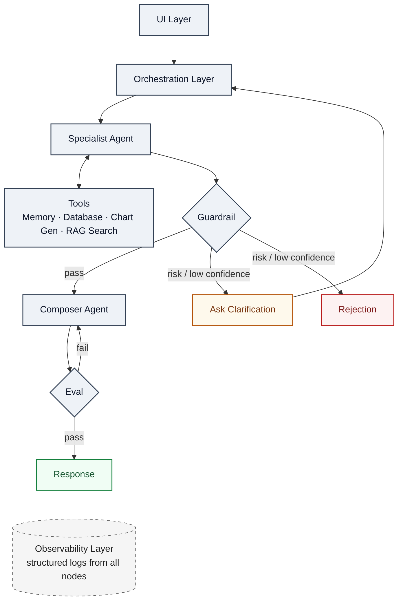

# ai-chatbot-demo
Building a simple ai chatbot from scratch using steamlit and langchain stack

## Demo-video
Google Drive Preview: <link>https://drive.google.com/file/d/1TkXa_gCnoWwTW-VPamjwsYO1sTxOzxae/view?usp=share_link</link>

Download: <link>https://github.com/Samlilol/ai-chatbot-demo/blob/main/Analytic-Chatbot-Demo.mp4</link>

## Architecture

